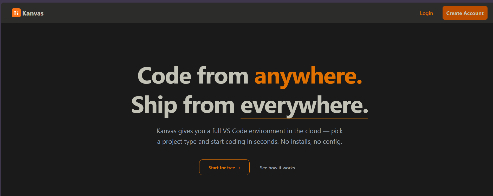
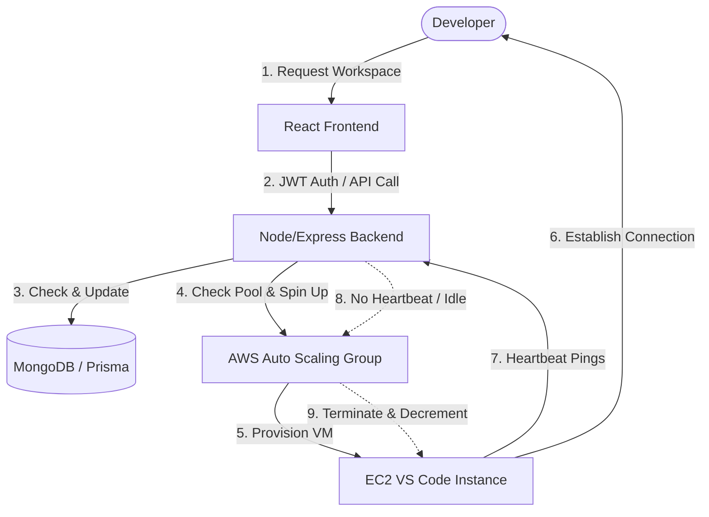

# Kanvas 🎨

[](https://kanvas.usecerebro.co.in)
[](https://www.typescriptlang.org/)
[](https://react.dev/)
[](https://nodejs.org/)
[](https://aws.amazon.com/)
[](https://www.prisma.io/)
[](https://www.mongodb.com/)

🔗 **Live Application URL**: [http://kanvas.usecerebro.co.in](http://kanvas.usecerebro.co.in)

**Kanvas** is a cloud-based development environment platform (similar to Replit, Gitpod, or GitHub Codespaces) designed to provision, lifecycle-manage, and host full VS Code development environments on-demand in the cloud. It allows developers to start coding in seconds from any browser with zero local configuration.

## 🖥️ Preview



---

## 🚀 Unique Selling Proposition (USP)

### 💡 Auto-Scaling with Active-Heartbeat Lifecycling

The biggest challenge with self-hosted cloud IDE platforms is **cloud compute waste**. Developers frequently leave workspaces open, forgetting to terminate them, which results in massive, unnecessary cloud bills.

Kanvas solves this with a **custom-engineered Heartbeat Lifecycling Mechanism**:

1. **Active Heartbeats**: When a developer is active in their cloud workspace, the environment (or dashboard) periodically pings the Kanvas backend API (`/heartBeat/:projectId`).
2. **Idle Detection**: The backend runs a background monitor every 60 seconds to scan all active virtual machines (`ALL_MACHINES`).
3. **Graceful Auto-Termination**: If a machine does not receive a heartbeat signal within the defined `GRACE_PERIOD` (configured in seconds), it is deemed idle/dead.
4. **AWS Auto-Scaling Integration**: The backend automatically triggers the termination of the idle EC2 instance via the AWS Auto Scaling SDK and decrements the desired capacity of the Auto Scaling Group (ASG).

> [!IMPORTANT]
> **Why this is a game-changer:** You only pay for active development time. If a developer walks away or closes their laptop, the underlying server is terminated automatically, reducing idle cloud costs by up to **90%** compared to traditional persistent VM setups.

---

## 🏗️ Architecture & How It Works

Kanvas uses a React-based frontend dashboard, an Express backend orchestration layer, a MongoDB database for persistence, and directly interfaces with AWS Auto Scaling Groups to handle dynamic instance spawning.



1. **Pre-Warmed Pool**: The backend maintains a pool of pre-warmed running instances in the AWS Auto Scaling Group.
2. **Instant Assignment**: When a user selects a runtime (Node, React, Python, or Full Stack), the backend assigns an unused machine from the pool, registers it to the user's project in the database, and provides the access DNS/IP.
3. **Capacity Adjustment**: As pool instances are claimed, the backend calls AWS SDK v3 to increase the ASG's desired capacity, making sure another pre-warmed instance starts booting up for the next user.
4. **Safety Limits**: To prevent abuse and runaway budgets, users are capped at a maximum of **2 active projects** concurrently.

---

## 🛠️ Tech Stack

### Frontend

- **Framework**: React 18 (TypeScript)
- **Bundler**: Vite
- **Styling**: TailwindCSS
- **State & Routing**: React Router DOM
- **Authentication**: JWT & Google OAuth2 Integration

### Backend

- **Runtime**: Node.js & Express (TypeScript)
- **Database ORM**: Prisma Client (with MongoDB adapter)
- **Cloud Orchestration**: AWS SDK v3 (`@aws-sdk/client-auto-scaling` & `@aws-sdk/client-ec2`)
- **Authentication**: Google Auth Library & JsonWebToken (JWT)

---

## ⚙️ Configuration & Environment Variables

You need to configure both the backend and frontend environment files. Use the `.env.example` templates provided in the respective directories.

### Backend Configurations (`Backend/.env`)

```env
PORT=9092
SECRET_KEY=your_jwt_secret_key
DATABASE_URL=mongodb+srv://...  # MongoDB connection string

# AWS Configuration
ACC_KEY_ID=your_aws_access_key_id
SECRET_ACC_KEY=your_aws_secret_access_key
AUTO_SCALING_GROUP_NAME=your_aws_asg_name

# Heartbeat & Lifecyling
GRACE_PERIOD=300000             # Time in milliseconds (e.g. 5 minutes) before terminating idle VMs

# OAuth
GOOGLE_CLIENT_ID=your_google_oauth_client_id
GOOGLE_SECRET=your_google_oauth_client_secret
```

### Frontend Configurations (`Frontend/ReplitFrontend/.env`)

```env
VITE_BACKEND_URL=http://localhost:9092
VITE_GOOGLE_CLIENT_ID=your_google_oauth_client_id
VITE_GOOGLE_SECRET=your_google_oauth_client_secret
```

---

## 🚀 Setup & Installation

### Prerequisites

- Node.js (v18+)
- MongoDB database instance (Atlas or local)
- AWS Account with an Auto Scaling Group containing pre-configured AMI instances running VS Code Server (code-server).

### 1. Database Setup (Prisma)

Navigate to the `Backend` directory, install packages, and generate the Prisma Client:

```bash
cd Backend
npm install
npx prisma generate
```

### 2. Running the Backend

Start the Express server in development mode:

```bash
# In the Backend directory
npm run dev
```

The server will boot on port `9092` (or your configured `PORT`) and begin syncing with the AWS Auto Scaling Group.

### 3. Running the Frontend

Navigate to the frontend directory, install dependencies, and launch Vite's HMR dev server:

```bash
cd ../Frontend/ReplitFrontend
npm install
npm run dev
```

Open your browser to `http://localhost:5173` to access the Kanvas dashboard.

---

## 📦 Containerization & Deployment

Both the frontend and backend are equipped with `dockerfile` configurations for rapid container deployment.

To build and run the services via Docker:

#### Build Backend:

```bash
cd Backend
docker build -t kanvas-backend .
docker run -p 9092:9092 --env-file .env kanvas-backend
```

#### Build Frontend:

```bash
cd Frontend/ReplitFrontend
docker build -t kanvas-frontend .
docker run -p 80:80 kanvas-frontend
```

---

## 👥 Authors

- **Brijesh** ([@Brijesh-0106](https://github.com/Brijesh-0106))
