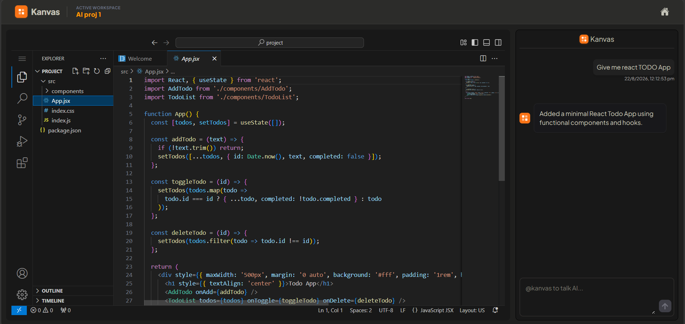
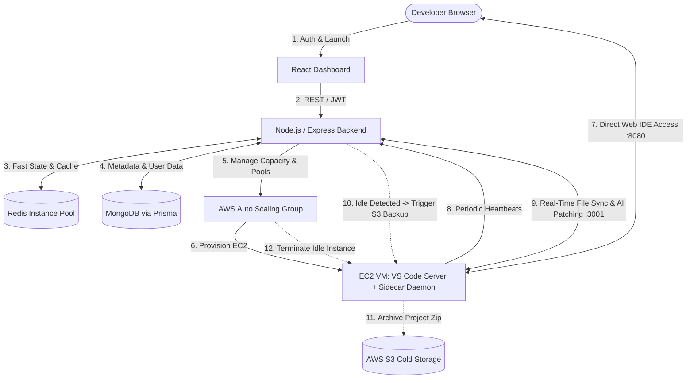

# Kanvas 🎨

[](https://kanvas.usecerebro.co.in)
[](https://www.typescriptlang.org/)
[](https://react.dev/)
[](https://nodejs.org/)
[](https://aws.amazon.com/)
[](https://redis.io/)
[](https://www.prisma.io/)
[](https://www.mongodb.com/)
[](https://www.docker.com/)

🔗 **Live Application URL**: [https://kanvas.usecerebro.co.in](https://kanvas.usecerebro.co.in)

**Kanvas** is a high-performance, cost-optimized cloud development environment platform (similar to Replit, Gitpod, and GitHub Codespaces). It provisions, lifecycle-manages, and orchestrates full browser-based VS Code environments on-demand in AWS EC2, complete with multi-language runtimes, automated idle auto-scaling, S3-backed workspace persistence, and an AI coding assistant.

---

## 🖥️ Preview



---

## ✨ Key Features

- ⚡ **Instant Workspace Provisioning**: Pre-warmed AWS Auto Scaling instances allow developers to jump into full VS Code environments in seconds.
- 💰 **Active-Heartbeat Auto-Scaling**: Background monitors detect idle workspaces and terminate underlying EC2 instances to cut cloud compute waste by up to 90%.
- 💾 **S3 State Persistence & Cold Storage**: Workspace files are automatically zipped and saved to AWS S3 upon idle shutdown and rehydrated seamlessly when a developer returns.
- 🤖 **Context-Aware AI Assistant**: Integrated Groq LLM reasoning combined with embedding-based semantic code search (RAG) to generate code and directly patch workspace file trees.
- 📁 **In-VM Real-Time Sync Daemon**: Lightweight sidecar agent inside every EC2 instance uses Chokidar to monitor filesystem events and sync changes back to the cloud.
- 🚀 **Multi-Runtime Environments**: Out-of-the-box support for **Node.js**, **React (Vite + TypeScript)**, **Python 3**, **Java 17 (OpenJDK)**, and **AI-Assisted Projects**.
- 🔒 **Enterprise-Grade Auth & Session Management**: Google OAuth 2.0 & JWT authentication with Redis-backed token revocation/blacklisting.
- ⚡ **High-Speed In-Memory State**: Redis manages pre-warmed instance pools, machine health states, and user project caching.

---

## 🚀 Unique Selling Proposition (USP)

### 💡 Auto-Scaling with Active-Heartbeat Lifecycling & S3 Cold Storage

The biggest challenge with self-hosted cloud IDE platforms is **cloud compute waste**. Developers frequently leave workspaces open, forgetting to terminate them, which results in massive, unnecessary cloud bills.

Kanvas solves this with an **end-to-end Heartbeat Lifecycling & Cold Storage Engine**:

1. **Active Heartbeats**: When a developer is active in their cloud workspace, the environment periodically pings the Kanvas backend API (`/heartBeat/:instanceId`).
2. **Idle Detection**: A backend background monitor continuously scans active machines (`ALL_MACHINES`) in Redis.
3. **Automated S3 Archival**: If a machine fails to emit heartbeats within the configured `GRACE_PERIOD`, the backend instructs the in-VM daemon to zip and push the workspace directory to AWS S3.
4. **AWS Auto-Scaling Scale-In**: The backend terminates the idle EC2 instance via AWS Auto Scaling SDK and decrements the desired capacity of the Auto Scaling Group (ASG).
5. **Seamless Rehydration**: When the user opens a stale project later, Kanvas claims a pre-warmed instance, downloads the archive from S3, and unpacks the workspace in seconds.

> [!IMPORTANT]
> **Cost Optimization**: You only pay for active development compute. If a developer walks away or closes their browser, the server is archived and terminated automatically.

---

## 🏗️ Architecture & System Design

Kanvas consists of four core microservices working together:


```mermaid
flowchart TD
    User([Developer Browser]) -->|1. Auth & Launch| FE[React Dashboard]
    FE -->|2. REST / JWT| BE[Node.js / Express Backend]
    BE <-->|3. Fast State & Cache| Redis[(Redis Instance Pool)]
    BE <-->|4. Metadata & User Data| DB[(MongoDB via Prisma)]
    BE -->|5. Manage Capacity & Pools| AWS_ASG[AWS Auto Scaling Group]
    AWS_ASG -->|6. Provision EC2| EC2[EC2 VM: VS Code Server + Sidecar Daemon]
    User <-->|7. Direct Web IDE Access :8080| EC2
    EC2 -->|8. Periodic Heartbeats| BE
    EC2 <-->|9. Real-Time File Sync & AI Patching :3001| BE
    BE -.->|10. Idle Detected -> Trigger S3 Backup| EC2
    EC2 -.->|11. Archive Project Zip| S3[(AWS S3 Cold Storage)]
    AWS_ASG -.->|12. Terminate Idle Instance| EC2
```

### Component Breakdown

1. **Frontend Dashboard (`/Frontend/ReplitFrontend`)**: React 18, Vite, TailwindCSS, Lucide/React-Icons, React Hook Form, Google OAuth2.
2. **Orchestration Backend (`/Backend`)**: Express.js, TypeScript, AWS SDK v3 (EC2 & Auto-Scaling), Prisma ORM with MongoDB, Redis, Groq SDK.
3. **In-VM Sidecar Daemon (`/VS-Dummy-Ins`)**: Node.js/Express service running inside each EC2 instance on port `3001` with Chokidar file-watcher and AWS S3 integration.
4. **Cloud IDE AMI**: Dockerized `codercom/code-server` with pre-installed Node.js 22, Python 3, Java 17, and development tooling.

---

## 🛠️ Tech Stack

| Domain | Technologies |
| :--- | :--- |
| **Frontend** | React 18, Vite, TypeScript, TailwindCSS, React Router DOM, React Hook Form |
| **Backend** | Node.js, Express, TypeScript, Prisma ORM, MongoDB |
| **Cloud & DevOps** | AWS Auto Scaling Groups, AWS EC2, AWS S3, AWS SDK v3, Docker |
| **Caching & State** | Redis (ioredis) |
| **AI & Search** | Groq SDK (`openai/gpt-oss-120b`), Vector Embeddings & Cosine Similarity |
| **Authentication** | JWT, Refresh Token rotation, Redis Blacklisting, Google OAuth 2.0 |
| **Core IDE Engine** | `code-server` (VS Code in the browser), Chokidar |

---

## ⚙️ Configuration & Environment Variables

### Backend Configurations (`Backend/.env`)

```env
PORT=9092
SECRET_KEY=your_jwt_secret_key
DATABASE_URL=mongodb+srv://...  # MongoDB connection string

# AWS Configuration
ACC_KEY_ID=your_aws_access_key_id
SECRET_ACC_KEY=your_aws_secret_access_key
AUTO_SCALING_GROUP_NAME=your_aws_asg_name

# Redis Configuration
REDIS_HOST=redis
REDIS_PORT=6379

# Heartbeat & Lifecycling
GRACE_PERIOD=300000             # Time in milliseconds before terminating idle VMs (e.g. 5 minutes)

# AI Engine
GROQ_KEY=your_groq_api_key

# OAuth
GOOGLE_CLIENT_ID=your_google_oauth_client_id
GOOGLE_SECRET=your_google_oauth_client_secret
```

### Frontend Configurations (`Frontend/ReplitFrontend/.env`)

```env
VITE_BACKEND_URL=https://kanvas.usecerebro.co.in/api
VITE_GOOGLE_CLIENT_ID=your_google_oauth_client_id
VITE_GOOGLE_SECRET=your_google_oauth_client_secret
```

### VM Sidecar Daemon Configurations (`VS-Dummy-Ins/.env`)

```env
PORT=3001
BUCKET_NAME=kanvas-staleproject-data
ACC_KEY_ID=your_aws_access_key_id
SECRET_ACC_KEY=your_aws_secret_access_key
```

---

## 🚀 Setup & Local Installation

### Prerequisites

- **Node.js** (v18+) & **npm**
- **Docker** & **Redis**
- **MongoDB** instance (Atlas or local)
- **AWS Account** configured with an Auto Scaling Group and S3 bucket

### 1. Database Setup (Prisma)

```bash
cd Backend
npm install
npx prisma generate
```

### 2. Running Redis

```bash
docker run -d --name redis -p 6379:6379 redis:alpine
```

### 3. Running the Backend

```bash
cd Backend
npm run dev
```

The server will boot on port `9092` and sync with Redis and the AWS Auto Scaling Group.

### 4. Running the Frontend

```bash
cd ../Frontend/ReplitFrontend
npm install
npm run dev
```

Open your browser to `http://localhost:5173`.

---

## 📦 Containerization & Deployment

### 1. Build & Run Backend
```bash
cd Backend
docker build -t kanvas-backend .
docker run -p 9092:9092 --env-file .env kanvas-backend
```

### 2. Build & Run Frontend
```bash
cd Frontend/ReplitFrontend
docker build -t kanvas-frontend .
docker run -p 80:80 kanvas-frontend
```

### 3. Build & Run VM Sidecar Agent
```bash
cd VS-Dummy-Ins
docker build -t kanvas-agent .
docker run -p 3001:3001 --env-file .env kanvas-agent
```

---

## 👥 Authors & Contributors

- **Brijesh** ([@Brijesh-0106](https://github.com/Brijesh-0106))
